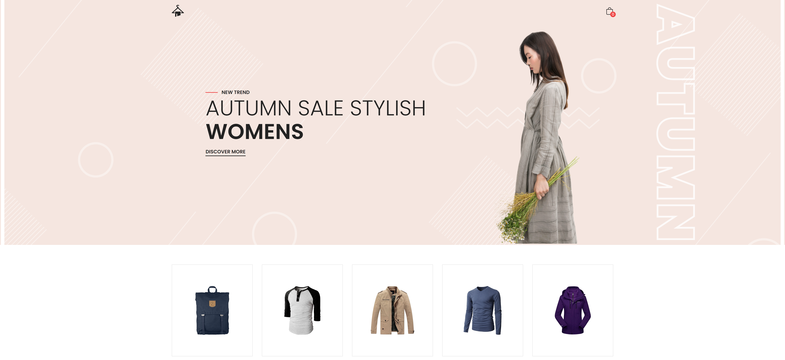

# StyleSphere

This web application serves as a minimalist showcase of my proficiency in fetching data from the FakeStoreAPI and implementing it into a functional tool. The UI design prioritizes simplicity and usability, providing users with an intuitive interface for seamlessly interacting with the fetched data.

## Demo

LIVE: [StyleSphere](https://hrs-style-sphere.netlify.app/)

## Screenshot

## Tech Stack

Yarn Vite React Tailwind FakeStoreAPI

## Author

### Hubert Śleszyński

Portfolio: https://hrs-dev.netlify.app/

Linkedin: https://www.linkedin.com/in/hubertsleszynski/

Github: https://github.com/HubertSleszynski
